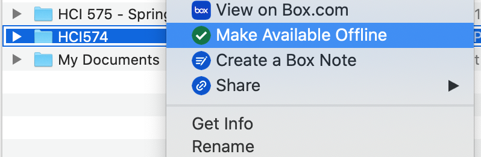
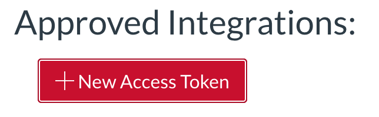

# Environment Setup
This document details how to setup the grading environment for HCI 574 in Mac OS X. If you are using Windows or Linux, you will have to adapt the manual setup instructions for your system

# Prerequisite Software
- Python 3+
- Pip3

Test for these prerequisites with the following commands.
```
python3 --version
```
```
pip3 --version
```
Note: To install the prerequisite software on Mac simply run the ```python3 --version``` command


# Box Setup
The homework files are stored in the cloud with the Box cloud storage service. The Box Drive utility allows your system to locally access these files.

1. Download the Box installer for your system. You can find the installers at this url https://www.box.com/resources/downloads
2. Sign into Box on your machine
3. Gain access to the HCI 574 folder from Chris Harding (charding@iastate.edu)
4. Make the HCI 574 folder available offline.
    - Open the folder where box stores the files
        - On OS X it is in ~/Box
    - Right click on HCI 574 and click "Make Available Offline"
    


# Get Canvas Access Token
Canvas' API uses access tokens. Access tokens allow 3rd party applications, like the tools in this environment, to edit grades and download homework programatically.
1. Generate Canvas Access Token  
    - Get access to the HCI 574 Canvas page from Chris Harding (charding@iastate.edu)
    - Goto: https://canvas.iastate.edu/profile/settings
    - Scroll down to Approved Integrations and click on "New Access Tokens"
    
    - In the popup dialog give this token a name and an expiration date after the course ends. 
    
    - Click Generate Token and record the token in a safe location.


# Get Canvas Course ID
Each course in Canvas has a unique course id. The course id is needed to ensure that the grades are correctly uploaded. The course id can be found by:
1. Navigating to the HCI 574 canvas page
2. Clicking on the navigation bar to see the full URL

The number at the end of the URL is the course id. (e.g. https://canvas.iastate.edu/courses/\<course-id\>) Make sure to save this in a safe place.

# Install Grading Tools
A install script is located in the HCI 574 homework directory. 

Note: this install script is designed for OS X only. To install on Linux and Windows, you will have to tailor the manual install instructions for your system.

Follow these instructions to use the install script:
1. Open the HCI 574 homework directory
```
cd ~/Box/HCI574/HCI574_<course-year>_HW
```
2. Set the execute permissions on the script
```
chmod +x ./install.sh
```
3. Ensure you have your Canvas Access Token and Canvas Course ID 
4. Run the install script with the command below and follow the prompts
```
./install.sh
```
5. After the script completes, restart your terminal or run the following command
```
source ./reload_config.sh
```

# Test nbgrader
1. Open a terminal and run the following command
```
start_grading
```

2. Quit out of jupyter notebook
    - Close your web browser
    - Press ```ctrl-c``` in your terminal
