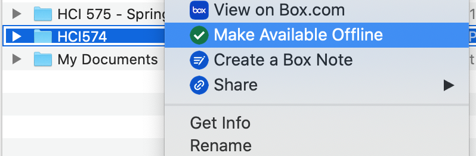
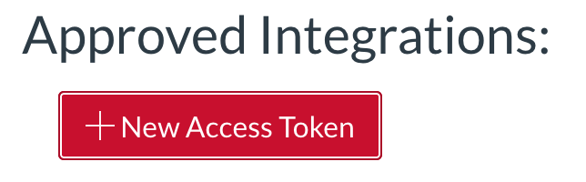
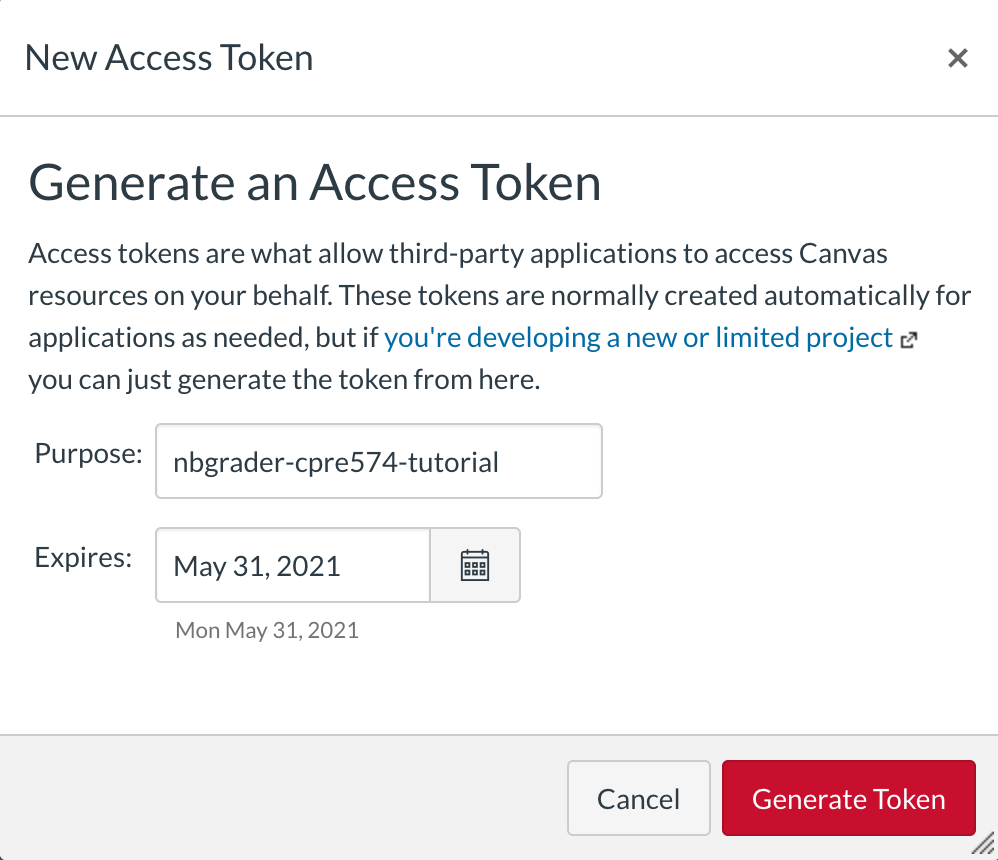

# updated by Chris Speing 2023


# Environment Setup
This document details how to setup the grading environment for HCI 574. This document was written for Mac OS X, but these instructions should also work for many linux distributions. 

# Prerequisite Software
- Python 3+
- Pip3

# Box Setup
The homework files are stored in the cloud with the Box cloud storage service. The Box drive utility allows your system to locally access these files.

1. Download the Box installer for your system. You can find the installers at this url https://www.box.com/resources/downloads
2. Sign into Box on your machine
3. Gain access to the HCI 574 folder from Chris Harding (charding@iastate.edu)
4. Make the HCI 574 folder available offline.
    - Open the folder where box stores the files
        - On OS X it is in ~/Box
    - Right click on HCI 574 and click "Make Available Offline"
    


# Install Jupyter Notebook and nbgrader
Juyper Notebook is the editor used to create and grade the homeworks. To install Jupyter Notebook, follow these steps.

0. Make sure python3 and pip3 is installed. You can check this with the following commands:
```
python3 --version
```
```
pip3 --version
```
1. Install Jupyter Notebook with this command:
```
sudo pip3 install notebook
```
2. Install nbgrader by running these commands:
```
sudo pip3 install nbgrader
```

__ Chris 2023__ just installing nbgrader will already install all lab and server extensions. jupyter nbextension and jupyter serverextension have been depreciated!


Not needed!
``` 
sudo jupyter nbextension install --user --py nbgrader --overwrite
```
``` 
sudo jupyter nbextension enable --user --py nbgrader
```
```
sudo jupyter serverextension enable --user --py nbgrader
```

# Setup Canvas Access Token
Canvas' API uses access tokens. Access tokens allow 3rd party applications, like the tools in this environment, to edit grades and download homeworks programmatically.
1. Generate Canvas Access Token  
    - Get access to the HCI 574 Canvas page
    - Goto: https://canvas.iastate.edu/profile/settings
    - Scroll down to Approved Integrations and click on "New Access Tokens"
    
    - In the popup dialog give this token a name and an expiration date after the course ends. 
    
    - Click Generate Token and record the token in a safe location.
2. Configure Access Token

    - Open a terminal and open the HCI 574 homework directory. Make sure to replace \<course-year\> with the correct year.
    ```
    cd ~/Box/HCI574/HCI574_<course-year>_HW
    ```
    - Copy the example config file to your home directory from the nbgrader_canvas_tool directory
    ```
    cp nbgrader_canvas_tool/example_of_.nbcanrc_or_nbcan.cfg ~/.nbcanrc
    ```
    - open ~/.nbcanrc with you favorite text editor and set the the following variables
        - Set the ```access-token``` variable to the access token that you generated earlier. 
        - Set the ```course-id``` variable from the course id number in the URL of the HCI 574 canvas page (e.g. https://canvas.iastate.edu/courses/\<course-id\>)
        - Set the ```root-dir``` variable to the location of the HCI574_\<course-year\>_HW folder.

# Configure Student List
0. Open a terminal and change directory to the nbgrader canvas tool directory (change \<course-year\> to the current course year).
```
cd ~/Box/HCI574/HCI574_<course-year>_HW/nbgrader_canvas_tool
```
1. Install Rarfile
```
sudo pip3 install rarfile
```

2. Export the list of students using the python script:
```
python3 nbgrader_canvas_tool.py export-student-list /tmp/student_list.csv
```
3. Import the list of students into nbgrader:
```nbgrader db student import /tmp/student_list.csv
nbgrader db student import /tmp/student_list.csv
```
4. Tie up the loose ends (optional):
```
rm /tmp/student_list.csv
```

# Test nbgrader
1. Open a terminal and change directory to the HCI 574 HW directory (change \<course-year\> to the current course year).
```
cd ~/Box/HCI574/HCI574_<course-year>_HW/
```

2. Open Jupyter Notebook by running:
```
jupyter notebook
```
