# Readme for HCI 574 Grading Space  (created for Spring 2020 course)
This readme details the setup and usage of the HCI 574 grading environment

## Setup
If you use Mac OS X, Follow the instructions in [Automatic-Setup.md](HCI574-Automatic-Setup/Automatic-Setup.md) located in the HCI575-Automatic-Setup sub-directory. 

If you use a flavor of linux or windows, study the [Manual-Setup.md](HCI574-Manual-Setup/Manual-Setup.md) and tailor the instructions to your system.

## Starting Grading Environment
If you used the automatic grading setup, open a terminal and type the following command
```
start_grading
```
This will open a new tab in your browser.

## Homework Creation
- In the browser window that opens up, click on the Formgrader tab.
- In the side menu, click on Manage Assignments and then Add new assignment
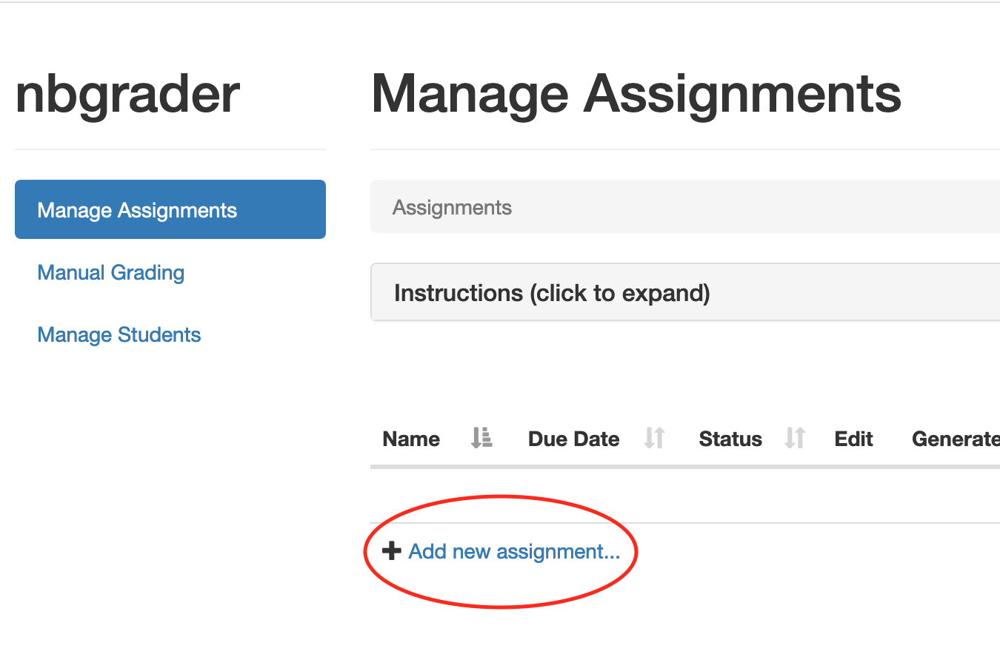
- Follow the prompts to add a new Jupyter Notebook homework
- This creates a file under the ```source``` subfolder. Notebooks in this folder should not be distributed to students.
- See previous year's source files for examples on the general structure of the homework (See Trimmed Directory Structure).

### Notes on Creating a New Assignment
- Text cells should be read-only
- Template code in optional problems needs to be wrapped in quotes and end with ```pass```. Without this, the cell for the optional question will print/run the template code in the notebook. See the example below:
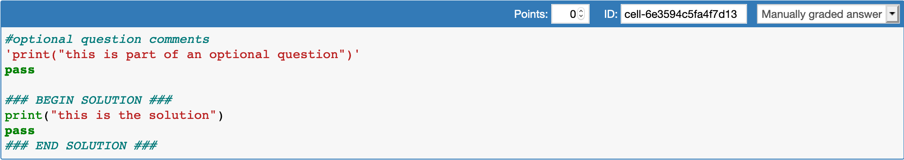
- This is also needed for commented out blocks using """
```
''' 
print("This is optional stuff")
a = 34
'''
pass
```

## Generating a Homework
After completing a source homework file, you will have to run the generate command to generate the files that will be released to the students. The generate command removes any answers that you may have stored in ```### BEGIN SOLUTION ###``` and ```### END SOLUTION ###``` blocks of the source homework files. 

To generate a homework, go the the Form Grader tab in your browser, and click on the generate button (See the image below). 

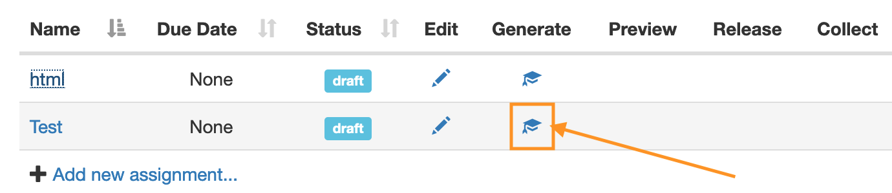

A success window should pop-up. Afterwards, the Form Grader tab will look like this:

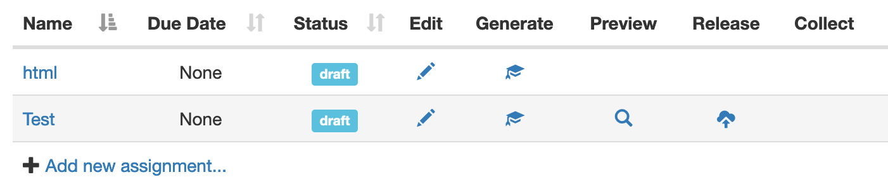

The generate command will create a new subfolder in  ```release``` (See Trimmed Directory Structure) that contains the files that should be distributed to students. 

## Releasing a Homework
After generating the student files, the homework needs to be released. This allows student submissions to be collected.

To release an assignment click on the release button (see the image below).

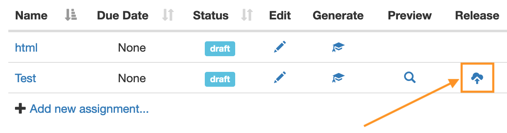

A window should pop-up indicating the assignment was released correctly. After the assignment has been released, the Form Grader tab should look like this:

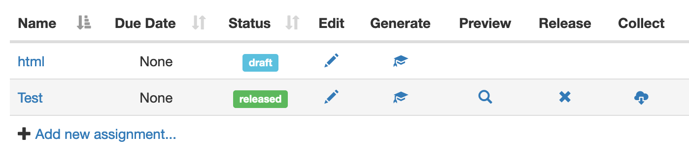

## Making Edits to an Assignment
After making any edits, un-release the assignment by pressing the ```X``` in the Release column to remove the previous files. Then repeat the instructions in ```Generate Assignment``` and ```Releasing a Homework``` to update the student files.


# Trimmed Directory Structure
These are the subfolders that are relevant to grading homeworks. Note, not all subdirectories are listed.
```
.
├── source
│   └── HW1_netid               <<< Source Homework files
├── release
│   └── HW1_netid               <<< Homework files for students
├── submitted
│   └── student_netid
│   │   └── HW1_netid           <<< Homework files recieved from students
├── autograded
│   └── student_netid
│   │   └── HW1_netid           <<< Autograded homework files (pre-manual grading)
├── feedback
│   └── student_netid
│   │   └── HW1_netid           <<< Feedback to be sent to canvas
└── zipped_HWs
```


# Grading Workflow
To grade assignments, you will use the nbgrader_canvas_tool.py script in conjunction with Jupyter Notebook.

## Downloading Assignments
To download the assignments you will need to first find the assignment ID from canvas. To do this, open up the assignment you wish to download on canvas. The assignment ID is the string of numbers at the end of the URL. See the example below:
```
https://canvas.iastate.edu/courses/<course-id>/assignments/<assignment-id>
```

Next you will need to run the nbgrader canvas tool with python. This following command works with Mac OS X. Replace ```<assignment-id>``` with the Canvas assignment id, and ```<assignment-name>``` with the name of the assignment (e.g. HW0_netid).

Run the command.
```
python3 nbgrader_canvas_tool.py download <assignment-id> <assignment-name>
```

Rarely, the download script finds multiple notebook files in a submission. This happens either because a hidden backup folder was submitted in addition to the notebook or a copy of the hw template was submitted. 

When this happens, the script will ask you to choose which notebook to grade. Usually, it is clear which is the correct notebook based on the file name. Backup files and backup folders generally look like they were autogenerated  vs being created by a person. Templates will have the generic name HWX_netid where as the student's HW file should be renamed to include their netid.

If it isn't clear from the file names, you can open up the notebooks by navigating to the folder path printed for each option.

## (Optional) Downloading Late Assignments or a Single Assignment
If a single assignment needs to be updated it is not necessary to download all of the assignments to add it to NBGrader. To download a single assignment run the following command in the nbgrader_canvas_tool folder:

```
python3 nbgrader_canvas_tool.py manual-submit <assignment-name> <student-netid> <path-to-zipped-single-assignment>
```
Note: path to zipped assg. should be zipped_HWs in 2022

Ex: python3 nbgrader_canvas_tool.py manual-submit HW9_netid charding ./zipped_HWs/HW9_charding.zip
This will be used when students hand in late or if their zipfile doesn't conform to proper naming

## Collecting Assignments in NBGrader
Once the assignments have been downloaded, they must be collected by NBGrader. To do this, open form grader and then click on the collect button (See image below).

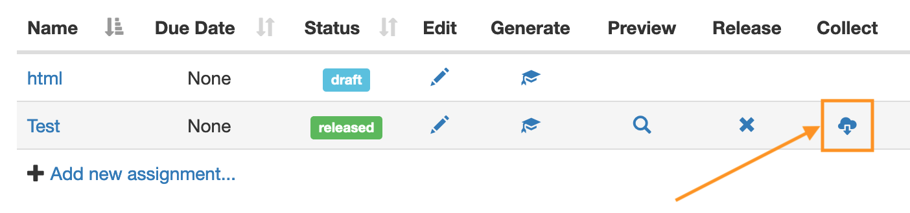


After collecting, the ```# of submissions column``` will update and the form grader tab should look like the following.

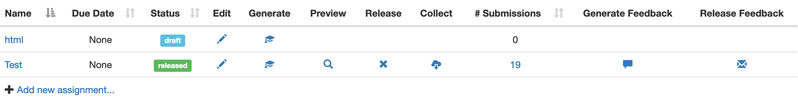

## Autograding Assignments
Before grading the assignments, NBGrader requires you to run the autograder for each assignment. To start the autograder, click on the number of submissions for the assignment you wish to grade (see image below):


To autograde an assignment you click on the lightning symbol for each assignment.

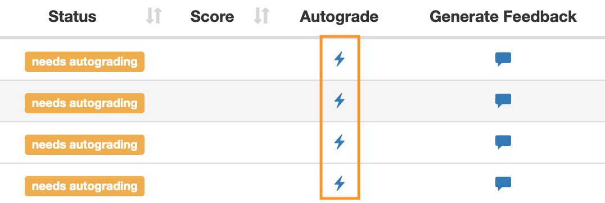

A window will pop-up when the autograding is done. After completion the Status will say needs manual grading.

## Manual Grading
To start manual grading click on the Manual Grading tab in the sidebar. In the new page click on the assignment you wish to grade.

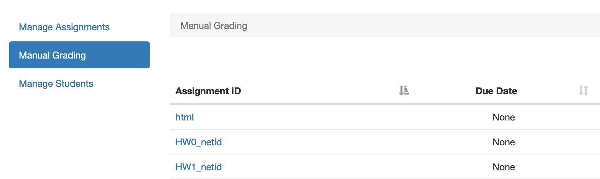

Keep clicking on the subfolders until you get to a list of submissions (see the image below):

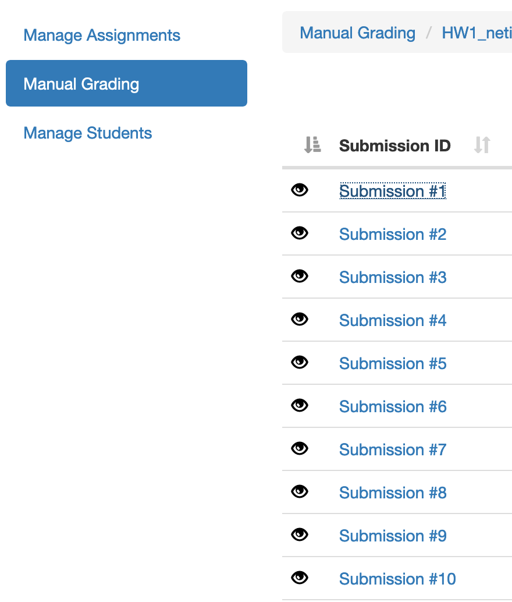

Click on the first submission to start grading. In the new page that pops up, assign a grade to each question that has a grading toolbar (see image below):

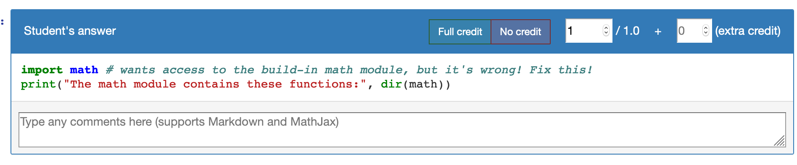

Note: for extra credit questions, you assign points in the (extra credit) box.

After assigning points to every question, you can click on the Next arrow at the top of the page to move to the next assignment.

## Generating Feedback
After completing the grading, you will need to generate the feedback files to submit to the students on canvas.

To do this, open up the Form Grader tab again and click on the Generate Feedback buttons (see image below):


## Uploading Feedback to Canvas
The last step to grading is to submit the course feedback to canvas. To do this, open a terminal in the nbgrader_canvas_tool directory. Then run the following command:

```
python3 nbgrader_canvas_tool.py upload <assignment-id> <assignment-name>
```

The tool will prompt you if you are ready to submit the grade for each student. Press p or P to submit the grade, or press s or S to skip that student. 


## (Optional) Uploading Feedback for a Single Student
To upload feedback to a single student re-run the upload command from the previous section. Press s or S to skip other students, and then press p or P when it prompts you to submit the student that you wish to send feedback to. i

TODO: make it so a student_id can be given as optional arg, to run only on that 


### 2022 changes
- auto generate the student csv file not working
- create from Canvas manually, see student_list_example.csv

id, last_name, first_name, email


- HW folder should be local copy for TA, not on Box (or at least not shared)

- where should grade.db go?

-  nbgrader db student add --last-name=test --first-name=test --lms-user-id=test
